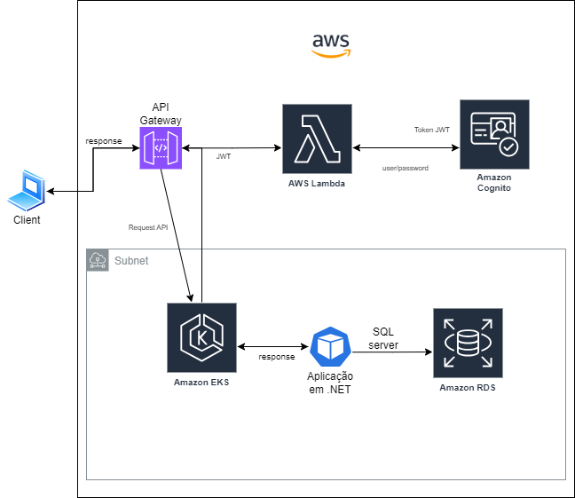

# techChallenge FIAP - G24 FASE 3

## Grupo 24 - Integrantes
💻 *<b>RM355456</b>*: Franciele de Jesus Zanella Ataulo  
💻 *<b>RM355476</b>*: Bruno Luis Begliomini Ataulo  
💻 *<b>RM355921</b>*: Cesar Pereira Moroni  

## Nome Discord:
Franciele RM 355456 
Bruno - RM355476 
Cesar P Moroni RM355921 

# Lanche Rápido

## Detalhes da aplicação

- A arquitetura está sendo estruturada pelo repositório responsável pela criação do EKS que utiliza o terraform 

- Autenticação está sendo estruturada pelo repositório que utiliza o Lambda + cognito

- O banco de dados é o relacional (SQL server) e está sendo estruturado em outro repositorio que utiliza o terraform e disponível no AWS RDS

## Desenho da arquitetura

